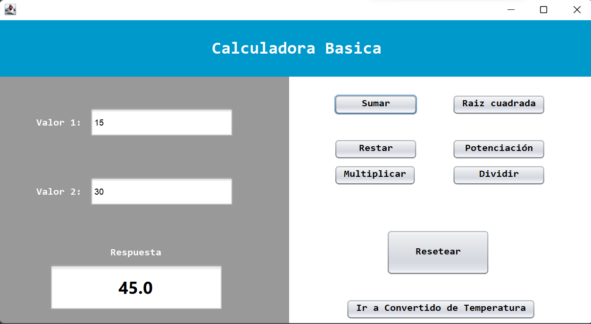
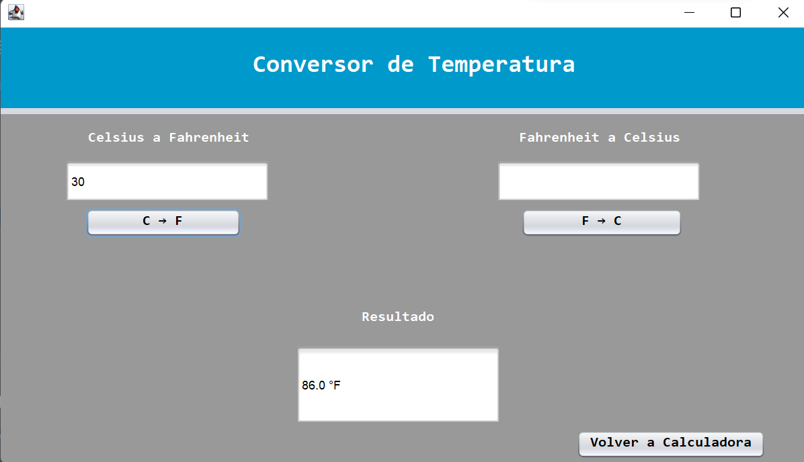

# 🧮 Calculadora y Conversor de Temperatura en Java Swing

## 📌 Descripción

Este proyecto consiste en una aplicación de escritorio desarrollada en Java utilizando Swing.
Incluye una calculadora con operaciones aritméticas básicas y avanzadas, así como un conversor de temperatura integrado en una interfaz gráfica amigable.

---

## ⚙️ Funcionalidades

### 🧮 Calculadora

* Suma
* Resta
* Multiplicación
* División
* Validación de división entre cero
* Raíz cuadrada
* Potencia (exponente)

### 🌡️ Conversor de Temperatura

* Celsius → Fahrenheit
* Fahrenheit → Celsius

### 🔄 Navegación

* Botón para ir de la calculadora al conversor
* Botón para regresar a la calculadora

---

## 🛡️ Validaciones Implementadas

* Campos obligatorios
* Solo se permiten valores numéricos
* Validación de división entre cero
* Validación de números negativos en raíz cuadrada
* Manejo de errores con mensajes claros

---

## 🖥️ Tecnologías Utilizadas

* Java
* Java Swing
* NetBeans IDE

---

## ▶️ Cómo Ejecutar el Proyecto

1. Abrir el proyecto en NetBeans
2. Ejecutar la clase principal (JFrame)
3. Ingresar valores en los campos
4. Seleccionar la operación deseada
5. Visualizar el resultado en pantalla

---

## 📸 Capturas del Sistema

### 🧮 Calculadora en funcionamiento

### 🌡️ Conversor de temperatura

### ⚠️ Error por división entre cero

---

## 👨‍💻 Autor

**Joshua Abreu**

---

## 📌 Notas

Este proyecto fue desarrollado como parte de una asignación académica para practicar el uso de interfaces gráficas en Java, manejo de eventos, validación de datos y uso de la clase Math para operaciones matemáticas.
