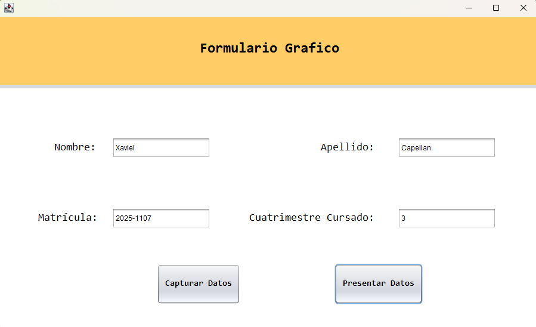
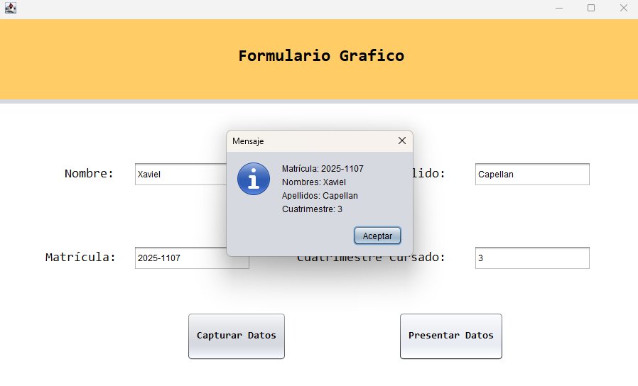

# Sistema de Captura y Presentación de Datos en Java Swing

## Descripción

Este proyecto consiste en una aplicación de escritorio desarrollada en Java utilizando Swing.
Permite capturar los datos personales de un participante y mostrarlos posteriormente, aplicando principios de **encapsulamiento** y **separación de responsabilidades** mediante una clase dedicada al procesamiento de datos.

---

## Funcionalidades

### Captura de Datos

* Matrícula
* Nombres
* Apellidos
* Cuatrimestre

### Procesamiento

* Almacenamiento de datos en una clase independiente (`ProcesarDatos`)
* Uso de atributos privados (encapsulamiento)

### Presentación

* Visualización de los datos ingresados mediante:

  * Ventana emergente (`JOptionPane`)

---

## Estructura del Proyecto

### Clase `ProcesarDatos`

* Atributos privados:

  * matrícula
  * nombres
  * apellidos
  * cuatrimestre

* Métodos:

  * `capturarDatos(...)`: recibe y almacena los datos
  * `presentarDatos()`: devuelve los datos en formato legible

### Interfaz Gráfica (GUI)

* 4 campos de texto (`JTextField`)
* 2 botones:

  * 🔹 **Capturar**: guarda los datos
  * 🔸 **Presentar**: muestra los datos

---

## Validaciones Implementadas

* Campos obligatorios (no vacíos)
* Validación de nombres y apellidos (solo letras)
* Validación de matrícula (formato válido)
* Validación opcional del cuatrimestre

---

## Tecnologías Utilizadas

* Java
* Java Swing
* NetBeans IDE

---

## Cómo Ejecutar el Proyecto

1. Abrir el proyecto en NetBeans
2. Ejecutar la clase principal (JFrame)
3. Ingresar los datos en los campos
4. Presionar el botón **Capturar**
5. Presionar el botón **Presentar** para visualizar los datos

---

## Capturas del Sistema

### Interfaz de captura de datos

### Presentación de datos

---

## Autor

**Joshua Abreu 2025-1107**

---

## Notas

Este proyecto fue desarrollado como práctica académica para reforzar el uso de interfaces gráficas en Java, así como la implementación de buenas prácticas de programación como el encapsulamiento y la separación entre lógica y presentación.
